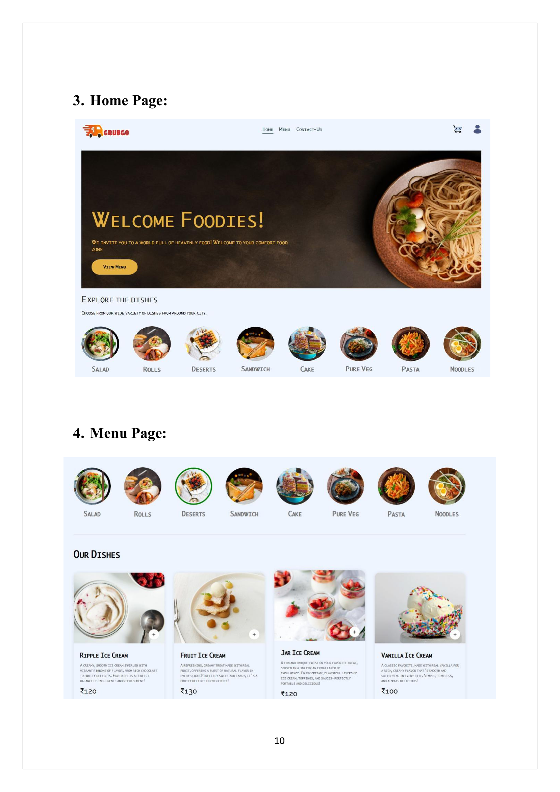

# 📦 GrubGo – Full Stack Food Delivery App

GrubGo is a full-stack food delivery application built with the MERN stack (MongoDB, Express, ReactJS, Node.js). It allows users to browse menu items, add items to the cart, and complete their purchase via a **Stripe-powered payment gateway**. An **admin dashboard** allows real-time management of orders and user activities.

---

### 🧭 Table of Contents

- [Features](#-features)
- [Tech Stack](#-tech-stack)
- [Folder Structure](#-folder-structure)
- [Getting Started](#-getting-started)
- [Environment Variables](#-environment-variables)
- [Screenshots](#-screenshots)
- [License](#-license)

---

### ✨ Features

#### 👤 User Side (Frontend)
- Browse restaurants and menu items
- Add/remove items to/from cart
- Checkout with **Stripe test payment gateway**
- View past orders

#### 🛠️ Admin Panel
- Dashboard for managing:
  - Orders
  - Menu items
  - Users
- Real-time order tracking
- View analytics/stats (if added)

#### 🔗 Backend
- REST API built with **Express**
- **MongoDB** for data storage
- Secure routes & token-based authentication
- Stripe API integration for payment

---

### 🛠️ Tech Stack

| Tech        | Usage                             |
|-------------|-----------------------------------|
| **ReactJS** | Frontend UI (user + admin panel)  |
| **Node.js** | Backend runtime                   |
| **Express** | API & routing                     |
| **MongoDB** | Database                          |
| **Mongoose** | MongoDB ODM                      |
| **Stripe** | Payment integration               |
| **JWT/Auth** | Secured user sessions             |
| **Axios** | API requests                      |

---

### 🗂 Folder Structure

```
GrubGo/
│
├── admin/          # Admin dashboard (React)
│   ├── components/ # React components for admin panel
│   ├── context/    # React context for state management
│   ├── pages/      # React pages for admin
│   └── ...         # Additional files
│
├── backend/        # Node.js + Express + MongoDB API
│   ├── routes/      # API route handlers
│   ├── controllers/ # Logic for handling API requests
│   └── models/      # MongoDB models (schemas)
│
└── README.md       # Project overview and setup guide

```

---

### 🚀 Getting Started

#### Prerequisites
- Node.js & npm
- MongoDB (local or cloud)
- Stripe account for API keys

---

### 1️⃣ Clone the Repository

```
git clone https://github.com/SAI-RAHUL-M/GrubGo.git
cd GrubGo
```

### 2️⃣ Install Dependencies

#### Backend

```
cd backend
npm install
```

#### Frontend
```
cd ../frontend
npm install
```

#### Admin Panel
```
cd ../admin
npm install
```

### 3️⃣ Run the App
Start MongoDB locally or use MongoDB Atlas.

#### Backend
```
cd backend
npm run dev
```

#### Frontend
```
cd ../frontend
npm start
```

#### Admin Panel
```
cd ../admin
npm start
```
---

### 🔐 Environment Variables
You'll need to set up .env files in each part of the app (especially backend). Here's a sample for the backend:
```
MONGO_URI=your_mongodb_uri
JWT_SECRET=your_jwt_secret
STRIPE_SECRET_KEY=your_stripe_key
```

#### 💳 Stripe Test Cards
Use this test card to simulate payments:
```
Card Number: 4242 4242 4242 4242
Expiry: Any future date
CVC: Any 3-digit number
ZIP: Any 5-digit number
```
---

### 📸 Screenshots





---

This project is licensed under the MIT License.
You are permitted to use, modify, and distribute this software in accordance with the terms of the license.
For any use, we kindly request that you contact us in advance.
